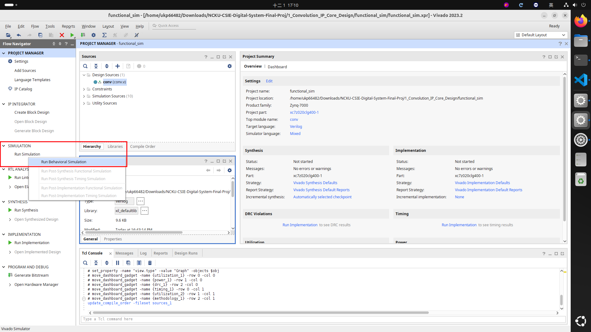
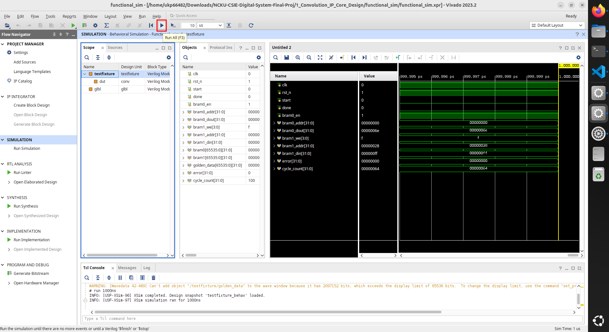
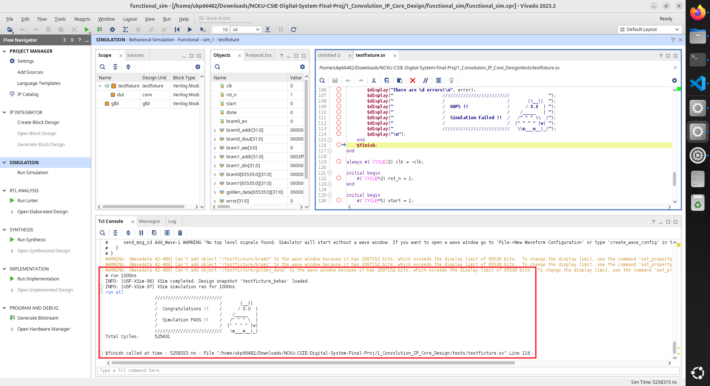

# Functional Simulation
Functional Simulation is the earliest and fastest stage of simulation in VLSI Circuit Design.
Its purpose is to verify the logical correctness of the RTL design without considering physical timing.

## 1. What Is Functional Simulation?
Functional Simulation runs at the RTL level (Verilog/SystemVerilog/VHDL) and checks only the functional behavior of the design.

Key characteristics:
- No timing delays (no LUT/FF/BRAM timing models)
- Does not require synthesis or implementation
- Simulation is fast
- Only RTL logic defines the waveform
- Ideal for debugging algorithms, FSMs, interfaces, and data flow

Functional Simulation does not verify setup/hold timing, clock skew, or real hardware delays.
It simply verifies whether "your RTL code works as intended."

## 2. Functional Simulation Flow in Vivado
Follow the steps below to run the functional simulation using the provided TCL script.

### a. Complete the `src/conv.v` 
Once the project is created, open the `src/conv.v` file and complete the missing RTL logic according to the specification in `IP_spec.md`.

### b.Selecting the Testbench Datasets Using define

The file `testfixture.sv` supports multiple testbench datasets (`tb1`, `tb2`, `tb3`).
The dataset used for simulation is controlled through SystemVerilog define macros.

Inside `testfixture.sv`, the initialization block is structured as follows:

``` sv
initial begin
`ifdef tb1
    `define IMG_HEIGHT 256
    `define IMG_WIDTH 256
    $readmemh("./bram0_tb1.hex", bram0);
    $readmemh("./bram1_tb1.hex", bram1);
    $readmemh("./golden_tb1.hex", golden_data);
`elsif tb2
    `define IMG_HEIGHT 256
    `define IMG_WIDTH 256
    $readmemh("./bram0_tb2.hex", bram0);
    $readmemh("./bram1_tb2.hex", bram1);
    $readmemh("./golden_tb2.hex", golden_data);

`else  //tb3
    `define IMG_HEIGHT 256
    `define IMG_WIDTH 256
    $readmemh("./bram0_tb3.hex", bram0);
    $readmemh("./bram1_tb3.hex", bram1);
    $readmemh("./golden_tb3.hex", golden_data);    
`endif
end
```

To select a specific dataset for simulation, you need to define the corresponding macro in the `testfixture.sv` file.

``` sv
`timescale 1ns/1ps
`define CYCLE 10
`define MAX_CYCLE 1000000
`define tb1 //you can change tb1 to tb2 or tb3 here
```

`Ctrl+S` to save the changes after selecting the desired dataset.

### c. Run the Functional Simulation






You must pass all test cases (`tb1`, `tb2`, `tb3`) to ensure the correctness of your RTL design.
