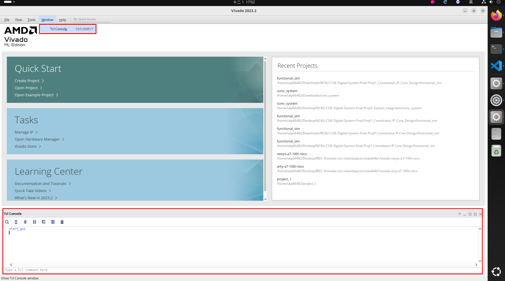
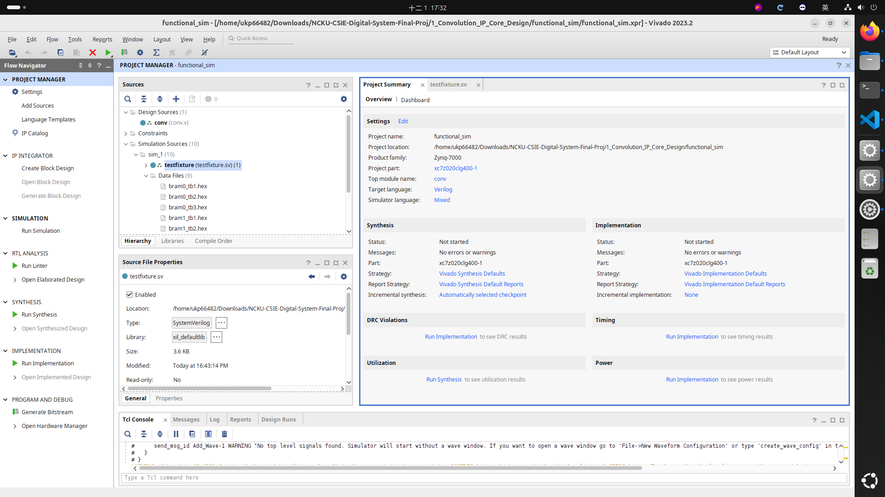

# 1_Convolution_IP_Core_Design
In this chapter, the convolution hardware module is implemented and verified at the RTL level.
The `src/` directory contains the Verilog source files for this module, including `conv.v`, which is provided as a partially completed implementation. Several sections inside `conv.v` are marked with `TODO: comments`, and you are required to complete these parts based on the behavior specified in `IP_spec.md`.

Functional simulation is supported through a provided testbench and a Tcl automation script, enabling you to verify correctness using predefined input datasets and golden outputs before integrating the module with the AXI-Lite interface in the next chapter.

## Functional Simulation Setup Guide
To verify the correctness of the implemented RTL, a functional simulation environment is provided.
Before modifying the Verilog source files, set up the simulation environment using the instructions below.

This ensures that the convolution logic can be tested with predefined input datasets and validated against golden outputs.

### a. Launch Vivado
Open Vivado 2023.2. Wait until the main interface is fully loaded.

### b. Open the TCL Console
The TCL Console is located at the bottom of the Vivado window.


### c. Navigate to the Project Directory
In the Tcl Console, change the current working directory to the folder that contains the functional_sim.tcl script.
``` bash
cd /path/to/NCKU-CSIE-Digital-System-Final-Proj/1_Convolution_IP_Core_Design
```

### d. Execute the Tcl Script to Create Project
``` tcl
source functional_sim.tcl
```
The script will automatically:
- Create a Vivado project
- Add all RTL and testbench files
- Set simulation properties

Below is a screenshot of the created project.


The file `Functional_Simulation.md` contains the complete procedure for running functional simulation for this project.
It explains how the testbench structure (`tb1`, `tb2`, `tb3`) is used to validate the convolution IP.