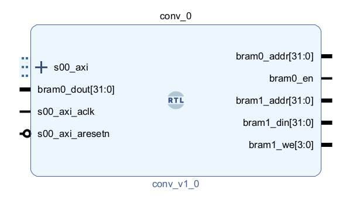

# IP_Spec
This document outlines the specifications for the AXI-Lite integrated convolution module IP core.

## AXI-Lite Register Map
The AXI-Lite interface of the convolution IP exposes four 32-bit slave registers (`slv_reg0` – `slv_reg3`).
For this project, only the first two registers are used:
| Register   | Address | R/W    | Usage                                                                        |
| ---------- | ------- | ------ | ---------------------------------------------------------------------------- |
| `slv_reg0` | 0x00    | Write  | Control register — bit `[0]` triggers the convolution core (`start`).        |
| `slv_reg1` | 0x04    | Read   | Status register — bit `[0]` reflects completion of the convolution (`done`). |
| `slv_reg2` | 0x08    | Unused | Reserved for future extension (not used in this project).                    |
| `slv_reg3` | 0x0C    | Unused | Reserved for future extension (not used in this project).                    |

## Register Behavior
### slv_reg0 — Start Register (Write Only)

- Software writes 1 to slv_reg0[0] to assert the start signal.
- This bit is directly forwarded to the convolution module as the start input.
- After the operation begins, software should clear this bit back to 0 to allow the next operation to be triggered.

### slv_reg1 — Done Register (Read Only)
- Hardware sets slv_reg1[0] to 1 when the convolution operation is completed.
- Software polls this register to determine whether the operation has finished.
- When the start signal is deasserted (cleared), hardware also clears slv_reg1[0] to 0 in preparation for the next run.

### Unused Registers (slv_reg2, slv_reg3)
- These registers are generated by the Vivado template but are not required for this design.
- The wrapper keeps them but no functional logic needs to be added.
- Their values may remain zero or unused.

## Port Descriptions
The AXI-Lite convolution IP exposes several ports for clock/reset, AXI-Lite control, and BRAM-based data access.
The figure below summarizes the top-level interface of the IP core:

### Clock and Reset Ports
| Port              | Direction | Description                                                                                         |
| ----------------- | --------- | --------------------------------------------------------------------------------------------------- |
| `s00_axi_aclk`    | Input     | AXI-Lite interface clock. All AXI-Lite logic and register operations are synchronous to this clock. |
| `s00_axi_aresetn` | Input     | Active-low AXI-Lite reset signal. Resets register logic and internal control FSM.                   |

### AXI-Lite Interface (s00_axi_)
These signals are generated automatically by Vivado’s AXI-Lite IP template.
You **do not** need to modify these low-level handshaking ports.

| Port Group    | Description                |
| ------------- | -------------------------- |
| `s00_axi_aw*` | AXI write-address channel  |
| `s00_axi_w*`  | AXI write-data channel     |
| `s00_axi_b*`  | AXI write-response channel |
| `s00_axi_ar*` | AXI read-address channel   |
| `s00_axi_r*`  | AXI read-data channel      |

### BRAM Interface Ports
These ports connect to the convolution hardware in your previous chapter.
They provide memory-like access to input and output images via external BRAMs.

| Port         | Direction | Width | Description                                    |
| ------------ | --------- | ----- | ---------------------------------------------- |
| `bram0_addr` | Output    | 32    | Address for BRAM0 (input image)                |
| `bram0_en`   | Output    | 1     | BRAM0 enable signal                            |
| `bram0_dout` | Input     | 32    | Data output from BRAM0 to the convolution core |
| `bram1_addr` | Output    | 32    | Address for BRAM1 (output image)               |
| `bram1_din`  | Output    | 32    | Data written to BRAM1 by the convolution core  |
| `bram1_we`   | Output    | 4     | Write-enable for BRAM1                         |
