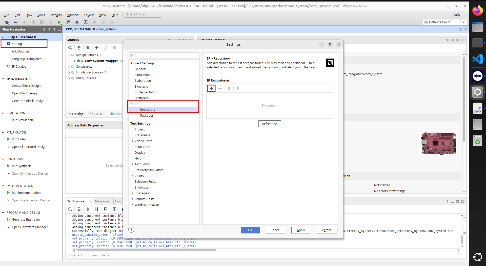
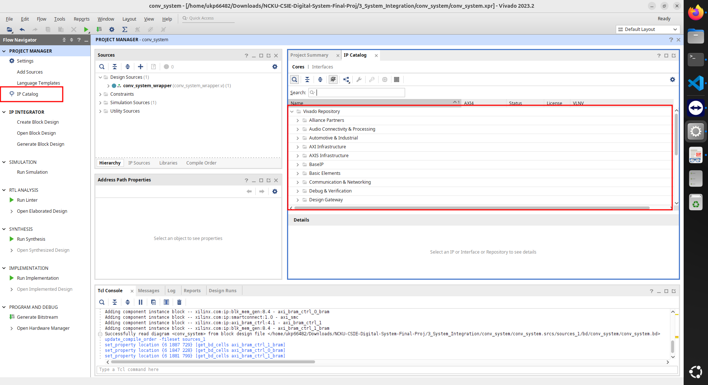
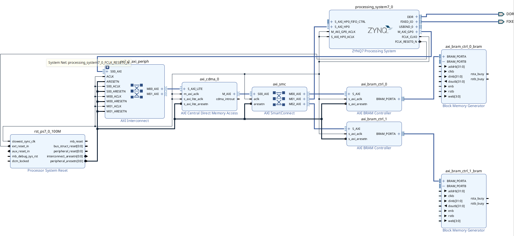

# 3_System_Integration

In this chapter, the convolution IP from Chapter 2 is brought into a system-level block design.

A base system has already been prepared to simplify the integration process.
Students **only need to understand the dataflow and connect the AXI-Lite IP between two BRAM blocks**.

## What Is Already Prepared
The provided Tcl script (`conv_system.tcl`) will automatically generate:
- Zynq Processing System (PS)
- AXI Interconnect
- AXI CDMA (used for DDR ↔ BRAM data movement)
- BRAM Controller 
- BRAM Blocks (BRAM0, BRAM1)
- Clocking & Reset logic
Pre-routed connections among all system infrastructure

In other words, the entire system backbone is already connected.
Students do not need to build the system from scratch.

## What You Need to Do in This Chapter

Your only task is to insert and connect the convolution AXI-Lite IP into the system.

Specifically:

1. Instantiate your AXI-Lite convolution IP in the block design
Use the IP created in Chapter 2. Add it into the base system generated by the Tcl script.

2. Connect the IP’s AXI-Lite interface, Attach S00_AXI to the AXI-Lite interconnect (connected by automation).

3. Connect the BRAM ports. 

Your convolution IP must be placed between BRAM0 and BRAM1, and some of the ports require Constant IP blocks (provided by Vivado) to drive fixed values when they are not externally controlled.


## How to Generate the Base System
1. Open Vivado 2023.2

2. Open the Tcl Console

3. Navigate to the folder
``` bash
cd /path/to/NCKU-CSIE-Digital-System-Final-Proj/3_System_Integration
```

4. Run the system-generation script
``` tcl
source conv_system.tcl
```

5. Add your IP to IP catalog
Refer to Chapter 2 for instructions on packaging your convolution IP into the IP catalog.


6. So that you see your convolution IP in the IP catalog.


This will create a complete project with the system already assembled.


Afterward, students only need to add the convolution IP and complete the required wiring.

For detailed information about the system architecture, all IP blocks, and how they interact, please refer to `System_Spec.md`.