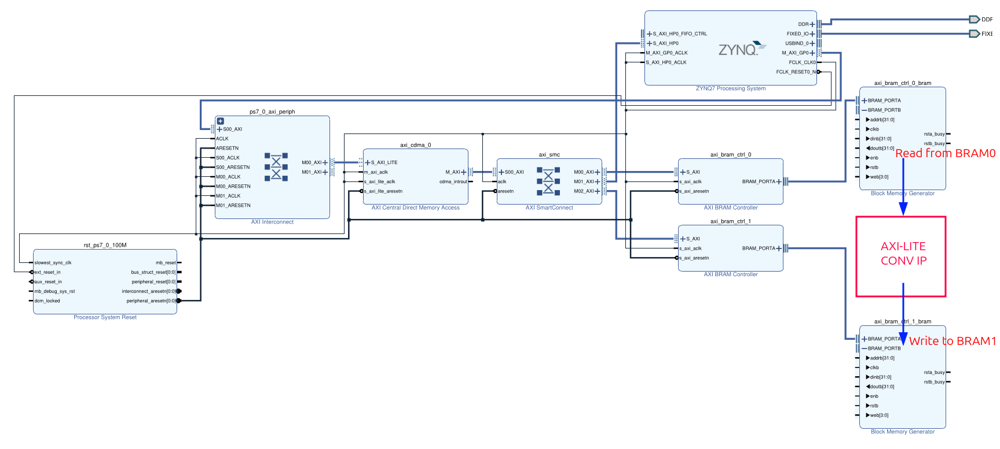

# System_Spec
This document describes the system-level architecture used in the final project, showing how the Processing System (PS), AXI infrastructure, BRAMs, and the AXI-Lite convolution IP are interconnected.
The goal of this chapter is for learners to understand the data flow, bus connections, and the role of each IP block before completing the final hardware integration tasks.

## 1. System Overview
The block design integrates the following subsystems:

- ZYNQ Processing System (PS)
- AXI Interconnect / SmartConnect
- AXI Central DMA (AXI CDMA)
- AXI BRAM Controller 0 / 1
- Two Block Memory Generator BRAMs (BRAM0 as input, BRAM1 as output)
- Custom AXI-Lite Convolution IP
- System Reset and Clocking

The figure below shows the system layout and data flow:

## 2. Functional Description of Each IP
### 2.1 Processing System (PS7)
- Acts as the AXI master, controlling the entire system.
- Loads the input image into DDR memory.
- Uses AXI CDMA to transfer data between DDR ↔ BRAM.
- Configures and starts the convolution IP via AXI-Lite.

### 2.2 AXI Interconnect / SmartConnect
Routes AXI transactions from PS to:
- AXI CDMA
- AXI BRAM Controllers
- AXI-Lite Convolution IP

Automatically handles clock-domain crossing and address decoding.

### 2.3 AXI CDMA
Used to perform high-speed memory transfer:
- DDR → BRAM0 (input image)
- BRAM1 → DDR (output result)

Operates independently once configured by PS via AXI-Lite.

### 2.4 BRAM Controllers
| Controller          | Connected BRAM | Purpose             |
| ------------------- | -------------- | ------------------- |
| **axi_bram_ctrl_0** | BRAM0          | Input image buffer  |
| **axi_bram_ctrl_1** | BRAM1          | Output image buffer |

### 2.5 BRAM0 – Input Buffer
- Connected to axi_bram_ctrl_0.
- Stores the raw grayscale image (width × height pixels).
- Read by the convolution IP through BRAM_PORTB.

### 2.6 BRAM1 – Output Buffer

- Connected to axi_bram_ctrl_1.
- Stores convolution results written from the convolution IP.
- Later transferred to DDR by AXI CDMA.

### 2.7 AXI-Lite Convolution IP
- Custom IP that performs Sobel convolution on the input image.
- Reads pixel data from BRAM0, processes it, and writes results to BRAM1.
- Controlled via AXI-Lite interface by PS (start signal, status monitoring).

## 3. Data Flow summary
- Step 1 — PS writes image to DDR
- Step 2 — AXI CDMA transfers DDR → BRAM0, BRAM0 now contains the input image.
- Step 3 — PS writes Start = 1 to convolution IP
- Step 4 — IP reads BRAM0, computes output, writes BRAM1
- Step 5 — IP sets Done = 1
- Step 6 — PS checks Done, writes Start = 0
- Step 7 — AXI CDMA transfers BRAM1 → DDR
- Step 8 — Python reads DDR output and displays the processed image